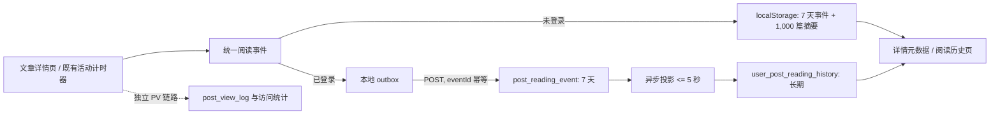

# 个人阅读历史与阅读摘要设计

## 1. 目标与边界

为当前读者提供两个互相独立但共享事实来源的能力：

1. 文章详情页在预计阅读时长旁展示读者自己的阅读次数、累计有效阅读时长和最近阅读时间。
2. 公共导航提供“阅读历史”页，按最近阅读时间倒序展示最多 1,000 篇去重文章，并可继续阅读。

本设计只处理文章。它不改变站点 PV、国家/设备分析、热门排序或后台访问明细；这些能力继续以 `post_view_log` 及其归档统计为唯一事实来源。阅读历史也不是公开指标：任何人都不能看到其他读者的次数或时长。

未登录读者的数据只在当前浏览器本地保存，绝不上传服务端，也不在登录、退出登录或注册时自动合并。登录读者的数据由服务端长期保存并可跨设备使用。两者采用同一阅读事件语义，区别仅在存储目标。

非目标：匿名跨设备同步、游客迁移到账号、手工删除历史、全站或文章公开阅读时长/次数、以阅读事件驱动计费、奖励或风控。

本规格落实 [ADR-0023](../../architecture/decisions/0023-reading-history-event-projections.md)；术语以[统一语言](../../architecture/ubiquitous-language.md)为准。

## 2. 当前状态与迁移原则

现有 `POST /posts/{slug}/reading-progress` 用 `visitToken` 更新 `post_view_log` 的单次访问进度。它属于访问分析链路：页面请求先产生 PV，前端 15 秒一次上报累计的活动秒数，Redis 中的 token 24 小时有效。

新实现将个人阅读能力移到独立模型：

- 保留文章请求时写入 PV 的现有行为，JavaScript 被禁用也不改变 PV 口径。
- 移除个人阅读对 `post_view_log`、`visitToken` 和 Redis token 的依赖；旧的阅读进度端点及其前端调用在同一实现 PR 中退役。
- 管理后台若仍需要展示旧访问明细中的进度，只展示历史数据；不得把新的个人阅读事件反写进访问日志。
- 数据库迁移只新增表，不把旧 `post_view_log` 中的阅读秒数回填为个人历史：旧数据无法可靠区分匿名/登录身份，也不是本功能的授权数据源。

## 3. 领域模型与数据生命周期

### 3.1 阅读事件

一次文章页加载生成唯一 `sessionId`；每条事件由浏览器生成 UUID `eventId`。事件字段语义如下：

| 字段                 | 说明                                                                         |
| -------------------- | ---------------------------------------------------------------------------- |
| `eventId`            | 事件唯一标识；同一存储目标内唯一，用于网络重试幂等。                         |
| `sessionId`          | 一次页面加载的会话标识，只用于关联，不作为用户或设备标识。                   |
| `postSlug`           | 浏览器侧文章标识；服务端由 slug 解析已授权文章并写入 `postId`。              |
| `type`               | `READ_OPEN`、`READ_HEARTBEAT`、`READ_COMPLETE`、`READ_CLOSE`。               |
| `activeSecondsDelta` | 本事件新增的有效阅读秒数；只允许心跳、完成和离开事件携带非负值。             |
| `maxScrollDepth`     | 本会话截至该事件的最大滚动百分比，范围 0–100。                               |
| `occurredAt`         | 浏览器记录时间，只作诊断；统计顺序以服务端 `receivedAt` 或本地写入时间为准。 |

`READ_OPEN` 在文章详情页成功初始化阅读脚本时立即记录，并且每次页面打开都使该文章的 `readCount` 增加 1。现有活动计时器继续采用“最近有用户活动的 60 秒窗口、每 15 秒结算”的规则；每次结算产生带增量秒数的 `READ_HEARTBEAT`，而不再重复上传累计值。达到既有完成判定（滚动至少 80%，或短文有效阅读至少 15 秒）时追加一次 `READ_COMPLETE`。`pagehide`/页面离开时把未结算的有效秒数作为 `READ_CLOSE` 尽力写入。

客户端对每一个已生成事件必须先持久化到本地事件队列，再尝试发送。网络重试必须复用同一个 `eventId`；服务端对重复 `eventId` 返回成功且不重复入库、不重复投影。单个事件的活动秒数、会话总秒数、字段长度和时间格式均由服务端严格上限校验，不能把客户端时间当作可信安全信号。

### 3.2 登录读者的服务端表

Flyway 新增以下表；确切迁移编号以合并时最新版本递增确定。

#### `post_reading_event`

登录读者的 7 天可重放事件事实表。

| 列                     | 说明                                   |
| ---------------------- | -------------------------------------- |
| `id`                   | 内部主键。                             |
| `event_id`             | 客户端 UUID；唯一索引保证幂等。        |
| `user_id`              | 由认证上下文取得的读者。               |
| `post_id`              | 已授权文章。                           |
| `session_id`           | 页面阅读会话 UUID。                    |
| `event_type`           | 四种阅读事件之一。                     |
| `active_seconds_delta` | 本事件新增有效秒数。                   |
| `max_scroll_depth`     | 0–100，可为空。                        |
| `occurred_at`          | 客户端声明时间，可为空，只用于诊断。   |
| `received_at`          | 服务端接收时间；投影和排序的权威时间。 |
| `projected_at`         | 成功投影时间；为空表示待处理。         |

索引至少覆盖唯一 `event_id`、待投影扫描 `(projected_at, received_at, id)`、清理 `(received_at)` 和按用户清除 `(user_id)`。不存 IP、User-Agent、Referer、设备指纹或客户端账号 ID。

#### `user_post_reading_history`

长期个人投影，一位用户和一篇文章恰有一行。

| 列                     | 说明                                     |
| ---------------------- | ---------------------------------------- |
| `user_id`, `post_id`   | 联合主键。                               |
| `read_count`           | 已投影的 `READ_OPEN` 数量。              |
| `total_active_seconds` | 已投影的有效阅读秒数之和。               |
| `first_read_at`        | 首次 `READ_OPEN` 的服务端接收时间。      |
| `last_read_at`         | 最近事件的服务端接收时间，用于历史排序。 |
| `updated_at`           | 最近一次投影更新时间。                   |

索引 `(user_id, last_read_at DESC, post_id DESC)` 支撑稳定游标分页。文章详情的“阅读摘要”只是该行面向当前认证读者的读取模型，不额外建第三张汇总表。

### 3.3 异步投影、重放与清理

事件接收事务只校验身份和文章可访问性、插入事件并返回 `202 Accepted`；不在用户请求内更新历史投影。独立的 Spring 定时任务以小批量领取 `projected_at IS NULL` 的事件，在同一事务内：锁定事件、对 `(user_id, post_id)` 原子 upsert 累加、设置 `projected_at`。多实例场景使用 MySQL named lock 或等价的数据库领取机制，保证同一事件不会并发投影；即使因崩溃重试，投影事务与 `projected_at` 更新必须原子提交。

投影的服务目标是事件接收后 5 秒内可查询。任务需要记录批量大小、待处理最早时间、投影数量、耗时和失败为可观测日志；发现连续超过目标或失败时记录 ERROR，不能静默跳过。

修复时，运维可以在受控维护入口将指定时间窗或未完成事件的 `projected_at` 重置后重放。重放前必须先在相同事务内重建受影响用户-文章投影，或按窗口建立独立补偿，禁止直接把已投影事件再次累加。事件只保留 7 天；每日清理 `received_at` 已过边界且已投影的事件。未投影的过期事件必须保留、记录 ERROR 并阻止清理，直到处理或人工处置完成。

删除账号时，在同一用户清除流程中删除该用户的 `post_reading_event` 和 `user_post_reading_history`。文章删除、下架、草稿或读者失去权限时不删除行，查询时通过可见文章条件过滤；文章恢复可访问后记录自然重新出现。

### 3.4 匿名读者的浏览器数据

匿名模式不调用任何个人阅读服务端写接口。浏览器维护两个版本化 localStorage 记录：

| Key                            | 内容与保留策略                                                             |
| ------------------------------ | -------------------------------------------------------------------------- |
| `bytedepth.reading-events.v1`  | 未登录阅读事件和登录状态下的待发送 outbox；按写入时间清除超过 7 天的记录。 |
| `bytedepth.reading-history.v1` | 按文章聚合的阅读历史；最多 1,000 篇，按 `lastReadAt` LRU 淘汰。            |

本地摘要至少包含 `postSlug`、`titleSnapshot`、`readCount`、`totalActiveSeconds`、`firstReadAt`、`lastReadAt` 和最后可用文章路径。每写入事件后在浏览器内同步更新对应摘要；多标签页是允许的简单 read-modify-write，冲突以最后写入数据为准，不引入 BroadcastChannel 或锁协调。

登录状态下，outbox 只是网络故障重试队列，而不是匿名迁移通道：仅保存当前已认证会话产生、尚未成功收到 `202` 的事件，最长 7 天。登录切换为退出时，尚未发送的登录 outbox 不得变成匿名事件；退出后新事件直接写匿名数据。匿名状态切换为登录时，既有匿名事件和摘要保持原样，新会话直接走登录事件通道，不上传或合并旧数据。

localStorage 不可用、空间满、内容损坏或私密模式抛错时，前端捕获异常并停止该浏览器的个人阅读记录；文章阅读、PV 与登录功能必须继续可用，也不得改为上传匿名数据。未知版本或无效 JSON 安全丢弃并重新初始化，不向用户显示错误弹窗。

## 4. 请求、页面与数据流

### 4.1 服务端接口

| 接口                                             | 身份与行为                                                                                                                                                                                                                                           |
| ------------------------------------------------ | ---------------------------------------------------------------------------------------------------------------------------------------------------------------------------------------------------------------------------------------------------- |
| `POST /posts/{slug}/reading-events`              | 仅已登录。身份仅从 session/security context 得出；接收一个事件，校验文章当前可访问性和字段上限，按 `eventId` 幂等写入，成功或重复均为 `202`。未登录返回 `401`，不接受 `userId`。请求使用现有站内认证/CSRF 约束；不得像旧匿名进度端点一样 CSRF 豁免。 |
| `GET /reading-history`                           | 登录时由服务端根据当前用户的长期投影做游标分页；未登录返回同一 HTML 骨架并由浏览器读取本地摘要。每页 20 篇，按 `last_read_at DESC, post_id DESC` 稳定排序。                                                                                          |
| `GET /reading-history/available-posts?slugs=...` | 仅解析匿名本地页所需的、数量受限的 slug 批次，返回当前公开且可访问文章的标题、slug、路径、发布日期和封面等展示字段；不返回任何阅读数据。不可访问的 slug 不出现在结果中。                                                                             |

文章详情页在登录时由服务端把当前用户的长期 `ReadingSummary` 放入模型；未登录只输出文章身份、标题和匿名数据容器，脚本从 localStorage 渲染同一展示组件。投影等待窗口中，登录前端在事件成功入队后先乐观更新当前页摘要，后续以服务端页面加载结果为准。

服务端历史查询和详情摘要必须均以当前认证用户为条件，绝不接受查询参数中的用户 ID。所有查询均连接文章可见性条件，避免标题、slug、存在性或阅读历史泄露给无权读者。

### 4.2 页面行为

- 公共顶部导航增加“阅读历史”，登录和匿名状态都可进入。
- 详情页的预计阅读时长保持原位置；存在摘要时在其相邻位置显示“已读 N 次 · 累计 X · 最近阅读于 Y”。从未读过的文章只显示预计阅读时长，不展示空的个人字段。
- 阅读历史行展示文章标题、最近阅读时间、累计次数、累计有效时长和继续阅读链接；服务端和匿名本地模式共享一个视觉组件和文案。
- 本地历史页先从摘要中分页取 20 条候选，再批量验证可访问文章，隐藏无结果的条目并继续补足本页；不可访问项保留在本地，文章恢复时重新出现。
- 历史只按文章汇总，不展示逐事件流水，也不提供清除、删除或匿名导入操作。

## 5. 组件与模块边界

新能力归入“访问与阅读分析”上下文，但与站点运营访问分析分离：

- domain：阅读事件类型、阅读摘要、阅读历史、事件接收/投影规则及端口；不依赖 Web、MyBatis、localStorage 或现有 PV 日志。
- app：接收当前认证读者事件、查询当前读者摘要/历史、投影调度用例；输入身份来自适配层的认证上下文，不从 DTO 透传客户端用户 ID。
- infrastructure：MyBatis 事件/投影仓储、Flyway、投影领取与清理；保留现有 `PostViewLogPort` 专门服务访问分析。
- adapter/start：Web 控制器、Thymeleaf 模型、导航和页面容器；`post-reading.js` 演进为只依赖页面 data attributes 的阅读事件客户端。localStorage 存储、outbox、匿名/登录来源选择和组件渲染封装在前端独立模块，不污染页面主题样式。

前端样式放在所有详情页和历史页都会加载的组件样式表，并新增资源归属静态检查，符合公共组件隔离约束。

## 6. 安全、隐私与可靠性

- 事件和投影不存 IP、User-Agent、Referer、设备指纹，也不读取匿名 localStorage 上传。
- 事件接收限流规则按已认证主体和文章维度定义；接口拒绝匿名、越权文章、无效 UUID、未知类型、超范围秒数/滚动值和过长字段。
- CSRF 使用站内默认防护；发送脚本携带页面提供的 CSRF 信息。离开页面优先使用能携带所需凭据的可靠传输，无法发送时保留 outbox 重试，不用绕过 CSRF 的匿名 beacon 端点。
- 事件重试、浏览器刷新和多标签页重复不能造成重复 `readCount` 或时长；唯一 `eventId` 是服务端最终护栏。
- 历史查询、可用文章批量解析均设定参数数量和游标/请求体大小上限，防止以 1,000 项 localStorage 直接放大单次请求。
- 账号删除的数据删除范围必须由集成验收覆盖；文章可见性变化只隐藏，不删除读者历史。

## 7. 测试与验收

每项新增业务逻辑需要单元测试，并满足本次变更业务分支 100% 覆盖率。至少覆盖：

- domain/app：`READ_OPEN` 只增加次数，活动秒数只按增量累计；重复 `eventId` 不重复累计；用户、文章边界和可见性过滤；游标稳定排序；账号删除；事件过期但未投影不清理。
- infrastructure：Flyway 表/索引、原子 upsert、投影领取并发、事务失败重试、7 天已投影事件清理与重放重建。
- web/security：登录/匿名访问、无客户端 user ID、CSRF、字段校验、`202` 幂等响应、阅读历史只能读取本人、不可访问文章隐藏。
- frontend：既有活动窗口与 15 秒结算复用；事件顺序和 eventId 重试；匿名 LRU 1,000 上限；本地事件 7 天淘汰；损坏/不可用 localStorage 静默降级；登录/退出立即切换且不迁移；同一摘要组件的渲染。
- 静态资源契约：详情页、导航、历史页均加载所需组件资源，公共样式不依赖局部主题资产。

本机只运行无外部进程的单元、静态和前端测试。Flyway、MySQL 投影并发、真实认证/CSRF、跨请求重试、浏览器 localStorage 和文章可见性场景由 release-platform 对候选完整 SHA 部署到 staging 后完成集成与 E2E 验收。通过的 staging 制品才可按既定流程提升生产。

## 8. 分阶段交付与回退

实现顺序：先迁移和领域/应用投影，再服务端登录接口与查询，再前端统一事件客户端和匿名存储，最后接入导航/详情 UI、测试及旧进度端点清理。每一阶段保持 PV 链路可用。

若需要回退应用代码，新表可保留且不影响旧 PV 链路；已写入的阅读事件和投影不迁回 `post_view_log`。一旦新客户端发布，回退版本不会显示个人摘要，但不得破坏文章访问或站点统计。数据库迁移遵循 Flyway 只前进原则。
